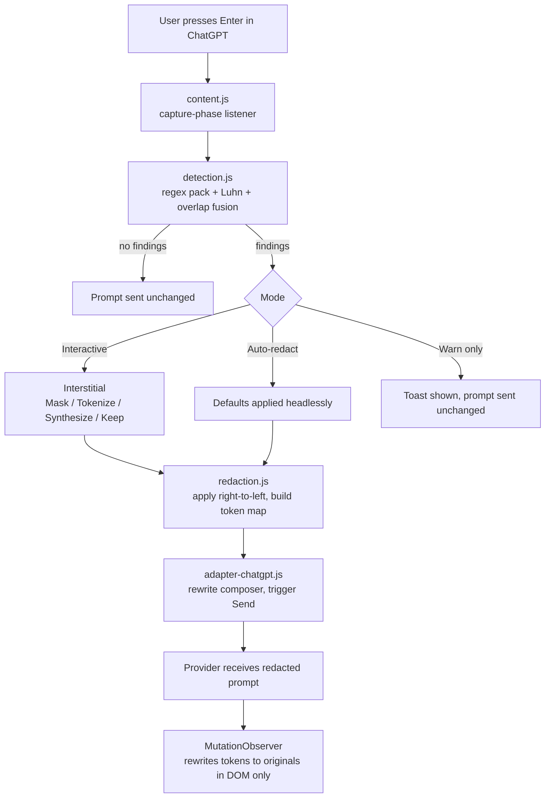

# SilhouetteAI

Browser extension that catches personally identifiable information in your prompt and lets you redact it **before it leaves your machine**.

Detection runs entirely on-device. The extension makes no network requests of its own — no telemetry, no remote inference, no prompt contents sent anywhere for analysis.

## What it does today

Working end to end on ChatGPT (`chatgpt.com`, `chat.openai.com`):

- **Intercepts before send.** Captures `Enter` keydowns and Send-button clicks in the capture phase, so the prompt is inspected before submission rather than after.
- **Detects** email, phone, SSN, credit card (Luhn-validated), API keys, JWT, IBAN, IP address, and date of birth.
- **Interstitial with live preview** and per-finding actions: Mask, Tokenize, Synthesize, or Keep.
- **Reversible tokenization.** A tokenized email reaches the provider as `[EMAIL_1_a7f3]`. When the model echoes the token back, the extension rewrites it to the real value *in the rendered DOM only* — the mapping never leaves the machine, and the raw network body still contains only the token.
- **Three modes:** Interactive (default), Auto-redact, Warn only.
- **Options page** with category toggles, an allowlist, a test panel, and an audit log that records timestamps, site, finding counts and chosen actions — never prompt contents.

## What it does not do yet

Stated plainly, because the gap determines what this actually protects against:

- **ChatGPT only.** The adapter pattern is in place; Claude, Gemini, Perplexity and Copilot each need their own `adapter-*.js`.
- **Regex detection only.** Free-form names, street addresses and organization names are **not** caught. The on-device NER layer (ONNX Runtime + WASM in an offscreen document) has a designed integration point in the service worker but is not built.
- **DOM interception only.** There is no page-world `fetch` shim yet, so if ChatGPT changes its DOM and the adapter misses a send event, the unredacted prompt goes through.
- **Short prompts can false-positive on phone** (any 10-digit run). Category toggles and the allowlist are the workaround.
- **No bundled icons.** Chrome shows the default puzzle piece until 16/48/128 PNGs are added to `manifest.json`.

## Install (unpacked)

```bash
git clone https://github.com/5ham5h33r/SilhouetteAI.git
```

1. Open `chrome://extensions` (or `edge://extensions`) and enable **Developer mode**.
2. Click **Load unpacked** and select the `extension/` folder.
3. Go to <https://chatgpt.com> and type a prompt containing PII, for example:

   > My email is jane.doe@example.com, my card is 4111 1111 1111 1111, and my phone is +1 (555) 123-4567.

4. Press `Enter`. The interstitial appears — choose actions, then **Send redacted**.

`Esc` cancels, `Ctrl`/`Cmd`+`Enter` sends.

## How a submission flows



Decisions are applied **right-to-left** so span offsets stay valid as the text length changes. A `_lastSubmitted` flag stops the handler re-firing on the echo when the adapter triggers Send itself.

## Repository layout

```
extension/
├── manifest.json
├── background/
│   └── service-worker.js         # install handler, RPC stub (Layer B lands here)
├── content/
│   ├── detection.js              # regex pack + Luhn + fusion (pure)
│   ├── redaction.js              # token map, apply + reverse
│   ├── interstitial.js / .css    # modal UI + toasts
│   ├── adapter-chatgpt.js        # site-specific DOM glue
│   └── content.js                # orchestrator
├── popup/                        # toolbar popup (enable / mode / action)
└── options/                      # settings, test panel, audit log
```

## Roadmap

In order: page-world `fetch` / `XMLHttpRequest` / `WebSocket.send` shim so interception survives adapter breakage → adapters for Claude, Gemini, Perplexity and Copilot behind a shared base class → offscreen document running `onnxruntime-web` with a distilled multilingual NER model for PERSON / ORG / ADDRESS → Firefox port → code-block-aware detection.

## Development

Vanilla JS. No build step, no dependencies. Modules are IIFEs registering on `window.__SILH`, and load order in `manifest.json` matters:

```
detection.js → redaction.js → interstitial.js → adapter-chatgpt.js → content.js
```

Storage keys: `piigSettings` (preferences), `piigLog` (last 100 audit events), `tokmap:<site>::<conversationId>` (per-conversation token maps), `__silh_salt` (per-install salt for token names).

## Privacy posture

- No outbound network calls from the extension.
- No telemetry.
- Logs never contain prompt contents — only timestamps, site id, finding counts, and chosen actions.
- Permissions requested: `storage`, plus host permissions for `chatgpt.com` and `chat.openai.com` only.

## License

MIT.
